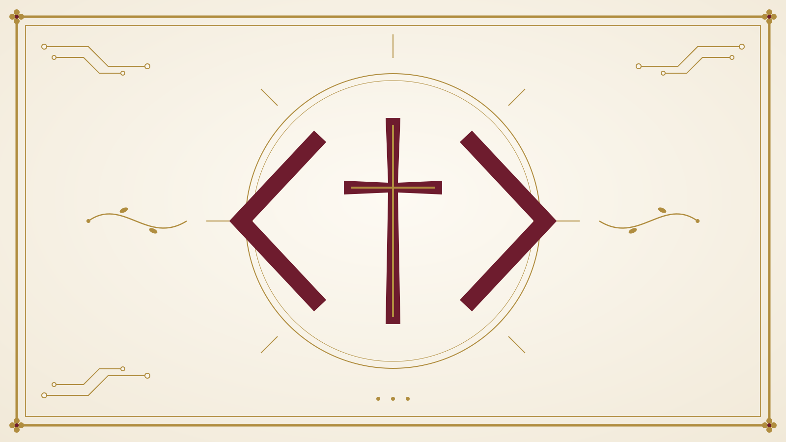

{fig-alt="Prayers for Computer Science" .front-image}

::: {.invitation}
Medieval books of hours gathered prayers for the rhythms of ordinary days. This is one for ours — for first days and finals week, for debugging and deploying, for the long grind and the quiet breakthrough. You are invited to bring your whole self — mind, heart, and soul — before God.
:::

::: {.doorways}
[Browse the prayers](prayers.qmd){.doorway}
[Contribute a prayer](contribute.qmd){.doorway}
:::

[A prayer for the morning]{.featured-label}

> Good morning, King of the Universe
>
> As I sip from my cup and think about the day ahead, you remind me that you are always present
>
> I thank you for the great duty of finding order in the code I create
>
> May my code be creative, effective, hospitable
>
> May my code be a reflection of the love I have for you and for my neighbor

[from *Morning coffee before coding*](10-rhythms/daily/morning-coffee.md){.featured-more}

::: {.colophon}
*"For from him and through him and for him are all things. To him be the glory forever! Amen."* — Romans 11:36

Curated by [Eric Araújo](https://ericaraujo.com), professor of Computer Science at Calvin University.
:::
